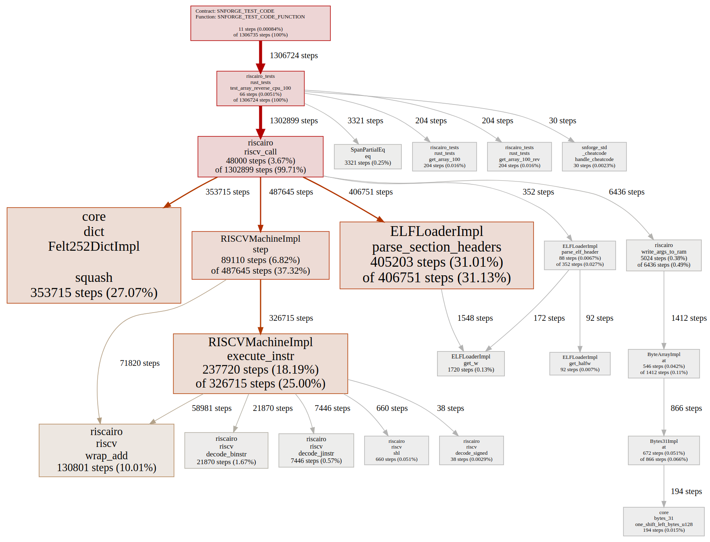

# riscairo

RISC-V ELF interpreter in cairo.

## Intro

This cairo library implements an ELF file parser and a RISC-V virtual machine.
The machine implements the RV32i instruction set, without extensions.

For usage information, please check https://github.com/massalabs/riscairo_template .

## Tests and benchmarks

To run all tests and benchmarks, use `./run_tests.sh`.

### Compliance tests

The VM is tested for compliance under the `rv32ui-p-*` test suite from https://github.com/riscv-software-src/riscv-tests .
Those are self-test ELF files in the folder `risc_compliance_checks`.

Below are benchmark results on three reference tasks:
* `array_reverse`: return a new array containing the elements of a provided random `u8` array in reverse order. `Input complexity` is the number of elements in the array. This is a memory read-write heavy task.
* `fibonacci`: compute the fibonacci sequence element as `u32` at index `Input complexity`. This is an iterative arithmetics-heavy task.
* `find_max`: return the maximum value in a provided array of random `u8`. `Input complexity` is the number of elements in the array. This is a branch-heavy task.

For each benchmark, there are two variants:
* One in which the algorithm is written in Rust and the pre-compiled ELF file. The benchmark accounts for loading the ELF file into the `riscairo` VM and running it from Cairo code.
* Another variant where the algorithm is written natively in Cairo and does not involve the `riscairo` VM.


Linear fits on the benchmark results:
```
In Rust guest within the Riscairo VM in array_reverse:
  Intercept (gas used at zero input complexity): 3429.82
  Slope (gas per unit of input complexity): 22.52
In native Cairo in array_reverse:
  Intercept (gas used at zero input complexity): 0.28
  Slope (gas per unit of input complexity): 0.29

In Rust guest within the Riscairo VM in fibonacci:
  Intercept (gas used at zero input complexity): 3520.00
  Slope (gas per unit of input complexity): 9.90
In native Cairo in fibonacci:
  Intercept (gas used at zero input complexity): 0.50
  Slope (gas per unit of input complexity): 0.16

In Rust guest within the Riscairo VM in find_max:
  Intercept (gas used at zero input complexity): 3449.70
  Slope (gas per unit of input complexity): 15.97
In native Cairo in find_max:
  Intercept (gas used at zero input complexity): 1.00
  Slope (gas per unit of input complexity): 0.20
```

Here is a hot spot analysis for the `find_max` task with input complexity 100:


